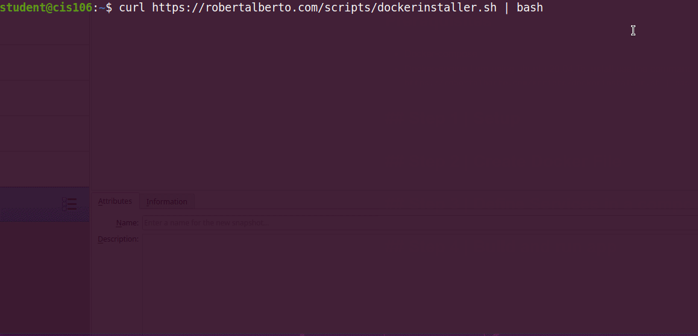
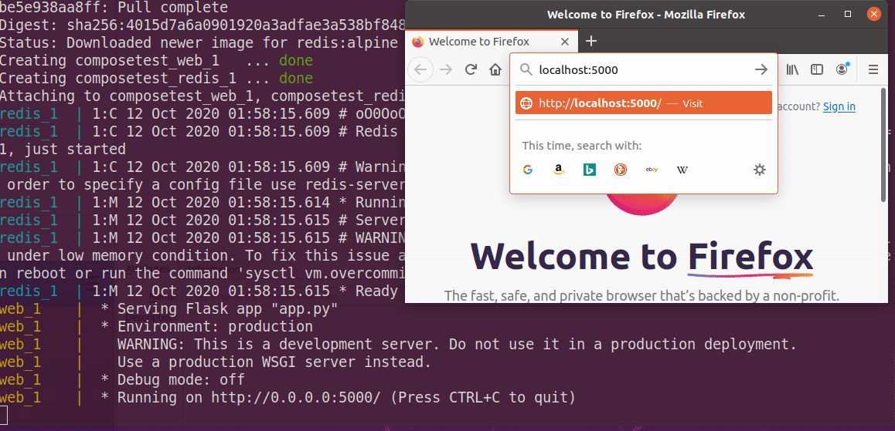
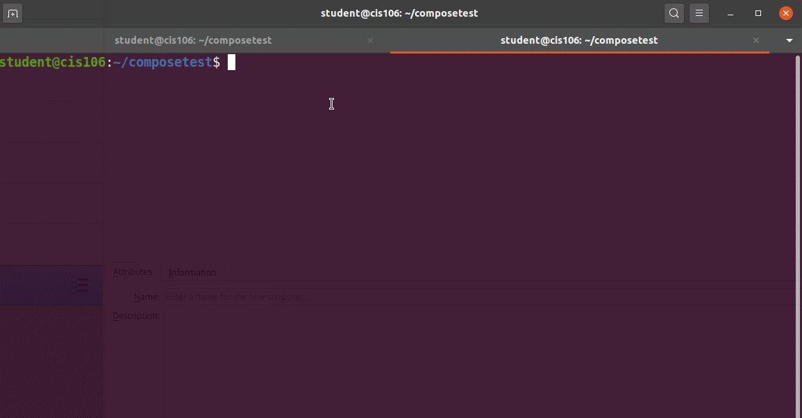
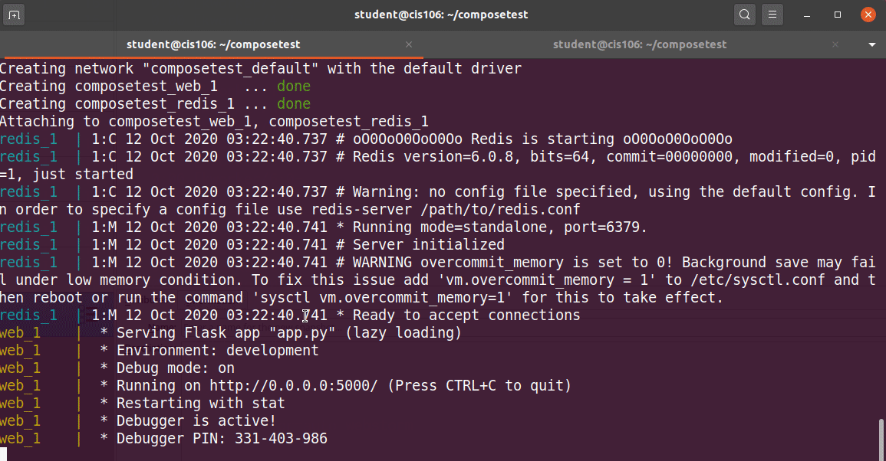

# Simple Docker app in Python
From: https://docs.docker.com/compose/gettingstarted/

## Prerequisites
* Docker-compose 
* Docker-engine
I am using ubuntu 20.04 To install use the command: 
* ``curl https://robertalberto.com/scripts/dockerinstaller.sh | bash``

## Step 1 | Setup

Define the application dependencies:
1. Create a directory and a file called app.py
2. Create a file called requirements.txt

## Step 2 | Create Docker File

Create a file called Dockerfile and write in it all the configuration:

## Step 3 | Define Services in a compose file

1. Create a file called docker-compose.yml
2. write the config

**I changed the version to version 3.7 because the version of docker installed in my system does not work with version 3.8.**
## Step 4 | Build and run app

To build the app use: `sudo docker compose up`

## Step 5 | Add Bind mount

## Step 6 | Update Application

## Step 7 | Other commands
* run your services in the background: `docker-compose up -d`
* run one-off commands for your services: `docker-compose run <service> <command>`
* Stop background docker-compose: `docker-compose stop`
* Bring everything down: `docker-compose down --volumes`

